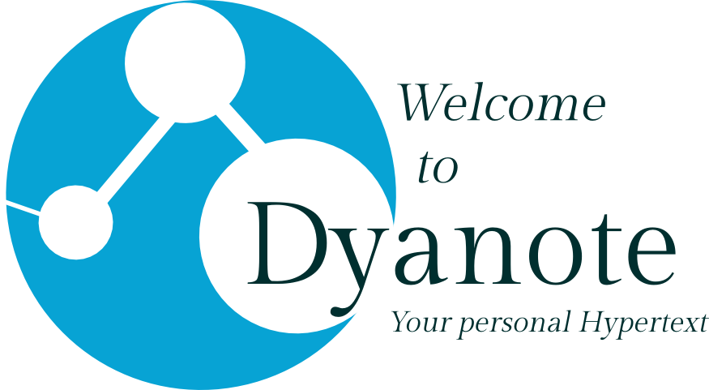
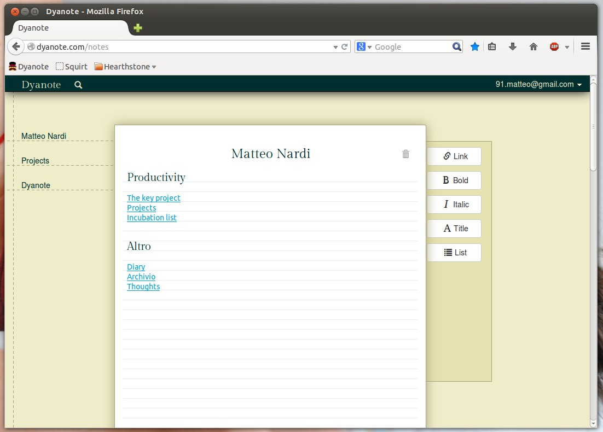

dyanote-client
==============

Dyanote was an hypertext-based note-taking application inspired by Tomboy.  
The application was written using the old AngularJs 1.

I dedicated quite some time to this project, but I never thought it to be good enough to share it with a wider audience... In the end I lost interest.
